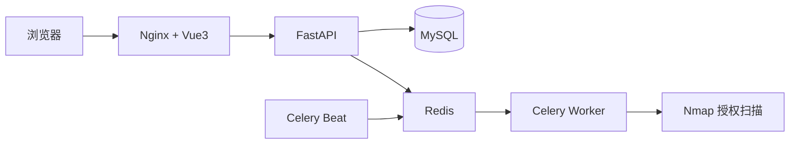
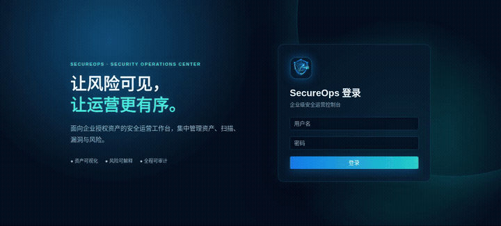

<div align="center">

# SecureOps

### 轻量级企业安全运营平台

`SOC` · `Asset Management` · `Vulnerability Management` · `Risk Analysis`

面向授权实验环境的可运行安全运营闭环，帮助你登记资产、执行安全扫描、管理漏洞并解释风险。

</div>

[](LICENSE)
[](docker/docker-compose.yml)
[](https://github.com/Bitesdust-3/security-platform-public/actions/workflows/ci.yml)

## 项目介绍

SecureOps 将资产登记、授权扫描、漏洞处置、CVE 情报、风险分析、自动化巡检、安全报告和审计记录串成一个可运行的安全运营闭环。项目适合在本地授权实验环境中学习和演示，不是面向公网生产环境的完整 SIEM 或漏洞利用平台。

> 适用范围：本地或隔离网络中的授权安全实验。请勿扫描未获授权的目标。

**快速入口：** [真实 Demo](docs/public/demo-secureops.webm) · [演示流程](docs/public/demo-flow.md) · [快速部署](#一键部署) · [完整文档](docs/public/)

## 功能特点

- 用户认证、JWT 和基础角色权限控制
- 资产管理、服务发现和停用策略
- 基于 Nmap 的授权安全扫描
- CVE/CVSS 漏洞管理与 NVD 情报同步
- 可解释风险评分、等级统计和趋势分析
- Redis + Celery 自动化扫描任务
- HTML/PDF 安全报告生成
- 关键操作审计日志和安全限流

## 技术栈 Tech Stack

| 层次 | 技术 |
| --- | --- |
| 前端 | Vue 3、TypeScript、Element Plus、ECharts |
| 后端 | Python、FastAPI、SQLAlchemy、Alembic |
| 数据库 | MySQL 8.4 |
| 任务队列 | Redis、Celery Worker、Celery Beat |
| 扫描器 | 授权实验环境 Nmap |
| 部署 | Docker、Docker Compose、Nginx |

## 系统架构 Architecture



## Screenshots / 项目截图

真实系统截图位于 `docs/public/screenshots/`：

| 页面 | 截图 |
| --- | --- |
| 登录页 | [`01-login.png`](docs/public/screenshots/01-login.png) |
| Dashboard | [`02-dashboard.png`](docs/public/screenshots/02-dashboard.png) |
| 资产管理 | [`03-assets.png`](docs/public/screenshots/03-assets.png) |
| 扫描任务 | [`12-demo-scans-completed.png`](docs/public/screenshots/12-demo-scans-completed.png) |
| 漏洞管理 | [`04-vulnerabilities.png`](docs/public/screenshots/04-vulnerabilities.png) |
| 风险分析 | [`13-demo-risk-dashboard.png`](docs/public/screenshots/13-demo-risk-dashboard.png) |
| 审计日志 | [`05-audit.png`](docs/public/screenshots/05-audit.png) |
| 安全报告 | [`06-reports.png`](docs/public/screenshots/06-reports.png) |

## Demo 展示

本项目 Demo 基于独立 E2E 环境和授权测试目标 `127.0.0.1` 录制，展示的均为真实系统功能和真实 API 数据。

- [观看或下载真实 Demo 录屏](docs/public/demo-secureops.webm)
- [查看完整演示流程](docs/public/demo-flow.md)



录屏涵盖登录、风险总览、资产管理、扫描任务、漏洞管理和安全报告。GitHub 对 WebM 的页面内播放支持因客户端而异，因此这里使用文件链接以保证兼容性。

### Demo关键页面

| 功能 | 截图 |
| --- | --- |
| 风险总览 | [`08-demo-dashboard.png`](docs/public/screenshots/08-demo-dashboard.png) |
| 资产管理 | [`09-demo-assets.png`](docs/public/screenshots/09-demo-assets.png) |
| 扫描完成 | [`12-demo-scans-completed.png`](docs/public/screenshots/12-demo-scans-completed.png) |
| 漏洞管理 | [`14-demo-vulnerabilities.png`](docs/public/screenshots/14-demo-vulnerabilities.png) |
| 安全报告 | [`15-demo-reports.png`](docs/public/screenshots/15-demo-reports.png) |

## 当前状态

当前版本为 `0.1.0` MVP 展示版本，已完成认证、资产、授权扫描、漏洞、CVE、风险、自动化巡检、报告、审计、前端和 Docker 编排。真实 Nmap 扫描仍必须在明确授权的实验环境中执行。

## Roadmap

- [x] 认证、资产、扫描、漏洞和风险闭环
- [x] Redis + Celery 自动化巡检
- [x] CVE 情报同步和安全报告导出
- [x] Docker Compose 部署与 CI 检查
- [ ] HTTPS 反向代理和生产环境密钥托管示例
- [ ] 更完整的多租户授权范围管理
- [ ] 可插拔的合规检查规则

## 部署 Deployment

推荐使用 Docker Compose 启动完整服务。详细说明见 [部署文档](docs/public/deployment.md)。

### Docker 部署

开发/演示环境复制 `.env.example` 为 `.env`；生产模拟环境复制 `.env.production.example` 为 `.env.production`。两者都必须设置强密码和随机 JWT 密钥，然后运行：

```bash
docker compose -f docker/docker-compose.yml --env-file .env up --build -d
```

生产配置启动方式：

```bash
cp .env.production.example .env.production
# 编辑 .env.production，填入真实密钥；该文件不会提交到 Git
docker compose -f docker/docker-compose.yml --env-file .env.production up --build -d
```

前端默认访问地址为 `http://localhost:8080`。后端入口会执行数据库迁移；首次部署请查看 [部署说明](docs/public/deployment.md)。

### 一键部署

准备 `.env`：

```bash
cp .env.example .env
```

生产环境必须保持 `ENVIRONMENT=production`、`SEED_DEMO_DATA=false`，并将 `CORS_ORIGINS` 改为实际访问来源。仅本地演示时才设置 `SEED_DEMO_DATA=true` 和 `DEMO_ADMIN_PASSWORD`，然后执行：

```bash
docker compose -f docker/docker-compose.yml --env-file .env up --build
```

前台调试可省略 `-d`；常规部署建议使用前文的后台启动命令，并通过 `docker compose ... logs -f backend` 查看日志。

启动流程会等待 MySQL 健康检查，执行 `alembic upgrade head`，按需初始化演示数据，再启动 FastAPI。演示数据使用文档测试网段并明确标注为 demo。生产模拟验证应使用独立的 `.env.production` 和独立 Compose 项目，避免与开发数据卷混用。

Docker MySQL 默认创建数据库 `security_platform` 和用户 `security_user`。请从 `.env.example` 复制生成未提交的 `.env`，为 `MYSQL_PASSWORD`、`MYSQL_ROOT_PASSWORD`、`JWT_SECRET_KEY` 和（如启用演示数据）`DEMO_ADMIN_PASSWORD` 设置安全值；这些敏感值不得写入源码或文档。

当前采用方案：从零开发简化版安全运营平台。

默认技术栈：

- 后端：Python + FastAPI
- 前端：Vue 3 + Element Plus
- 数据库：MySQL
- 部署：Docker + Docker Compose
- 扫描器：授权实验环境中的 Nmap，后续可扩展 Nuclei

## 目录

```text
backend/        后端代码、Alembic迁移和Celery任务
frontend/       前端代码
docker/         Dockerfile、Compose和Nginx配置
docs/           项目与部署文档
tests/          后端测试代码
```

## 安全边界

扫描功能仅面向用户明确授权的本地实验环境、单个目标或实验网段。项目不开发攻击真实目标、恶意代码或不必要的危险功能。

后端 API 说明见 [docs/public/api.md](docs/public/api.md)，贡献方式见 [CONTRIBUTING.md](CONTRIBUTING.md)，版本记录见 [CHANGELOG.md](CHANGELOG.md)。

测试说明见 [docs/public/testing.md](docs/public/testing.md)。默认单元测试使用 SQLite 内存数据库；MySQL 迁移测试和浏览器测试均使用独立测试环境，避免影响开发数据。

## 后端基础环境

环境要求：Python 3.12+、pip、FastAPI、Uvicorn。创建虚拟环境并安装依赖：

```bash
python3 -m venv venv
venv/bin/python -m pip install -r backend/requirements.txt
```

启动后端：

```bash
PYTHONPATH=backend venv/bin/uvicorn app.main:app --reload --port 8000
```

健康检查：访问 `http://127.0.0.1:8000/health`，应返回健康状态 JSON。完整功能建议通过 Docker Compose 启动。

## 数据库基础配置

设置 `backend/.env` 中的 `DATABASE_URL`，例如：

```text
DATABASE_URL=mysql+pymysql://security_user:<password>@localhost:3306/security_platform
```

在 `backend/` 目录执行 Alembic：

```bash
PYTHONPATH=. ../venv/bin/alembic revision --autogenerate -m "initial schema"
PYTHONPATH=. ../venv/bin/alembic upgrade head
```

本地单元测试使用 SQLite 进行快速验证；Docker 部署使用 MySQL 8.4，迁移由后端入口自动执行。

## 用户认证

后端提供注册、登录和当前用户接口。密码使用 bcrypt 哈希保存，JWT 密钥和过期时间通过环境变量配置：

- `POST /api/v1/auth/register`
- `POST /api/v1/auth/login`
- `GET /api/v1/auth/me`

运行认证测试：

```bash
PYTHONPATH=backend venv/bin/pytest -q tests/test_auth_api.py
```

## 资产管理 API

资产查询接口要求 JWT；普通用户可以查询列表和详情，管理员可以创建、更新、替换和停用资产。

- `GET /api/v1/assets?page=1&page_size=10&ip_address=&hostname=&asset_type=&status=`
- `POST /api/v1/assets`
- `GET /api/v1/assets/{id}`
- `PUT /api/v1/assets/{id}`
- `PATCH /api/v1/assets/{id}`
- `DELETE /api/v1/assets/{id}`

资产列表响应格式为 `data`、`total`、`page`、`page_size`，资产删除采用停用策略，不执行物理删除。

## 安全扫描模块

扫描模块只面向明确授权的私有、回环或文档测试地址。需要在系统中安装 Nmap，并通过 JWT 创建任务：

```bash
# Debian/Ubuntu 示例
sudo apt-get install nmap
```

接口流程：创建 `POST /api/v1/scans` → 启动 `POST /api/v1/scans/{id}/start` → 查询任务和结果。后端使用安全参数列表调用 Nmap，不接受任意命令参数，也不包含漏洞利用功能。

## 漏洞管理模块

漏洞记录维护标题、CVE、描述、严重等级、CVSS、状态、资产和扫描任务来源。支持管理员创建/更新、普通用户查询，以及分页筛选和统计：

- `POST /api/v1/vulnerabilities`
- `GET /api/v1/vulnerabilities`
- `GET /api/v1/vulnerabilities/{id}`
- `PUT /api/v1/vulnerabilities/{id}`
- `DELETE /api/v1/vulnerabilities/{id}`
- `GET /api/v1/vulnerabilities/statistics`

当前不执行自动漏洞库匹配、漏洞利用或攻击验证。

## 风险分析模块

风险分数采用可解释公式：

```text
单漏洞风险分 = 严重度基础分 + CVSS × 3 + 资产重要性 × 2 + 开放服务加分 10
资产风险分 = 所有关联开放漏洞风险分之和（上限 100）
```

等级划分：`critical 80—100`、`high 50—79`、`medium 20—49`、`low 0—19`。

接口：`/api/v1/risk/summary`、`/levels`、`/top-assets`、`/trend`。所有接口需要 JWT，普通用户只能查看授权扫描范围。

## 安全增强

- 统一日志输出到控制台和 `logs/security-platform.log`，支持 `LOG_LEVEL` 和轮转文件。
- 关键认证、资产、扫描和漏洞操作写入审计日志。
- 管理员可通过 `GET /api/v1/audit/logs` 分页查询审计记录。
- API 统一处理参数校验、HTTP 异常和未处理异常，不向客户端返回堆栈。
- JWT 密钥、数据库密码、CORS 来源和日志配置均通过环境变量设置。
- 登录失败默认 5 次/15 分钟触发临时限制，并记录来源 IP 的安全日志。
- API 默认按客户端 IP 限制为 300 次/分钟；当前为单进程内存限流，多实例部署应替换为 Redis 等共享存储。
- 模型时间字段统一使用时区感知 UTC 时间。

## 前端管理后台

前端使用 Vue 3 + Element Plus + TypeScript。启动方式：

```bash
cd frontend
npm install
npm run dev
```

页面包括登录、风险总览、资产管理、扫描任务、自动化巡检、漏洞管理和审计日志。前端默认通过 `/api/v1` 访问后端，可使用 `VITE_API_BASE_URL` 覆盖 API 地址。

## 自动化巡检

自动化巡检使用 Redis + Celery Worker + Celery Beat。定时任务配置持久化在新增的 `scan_schedules` 表中，Worker 执行授权范围内的 Nmap 服务发现，完成后保存真实扫描结果并同步资产服务信息；不虚构 CVE 数据。

Docker Compose 会启动 `redis`、`celery_worker` 和 `celery_beat`。首次部署需要执行迁移：

```bash
docker compose -f docker/docker-compose.yml run --rm backend alembic upgrade head
```

接口：`POST/GET /api/v1/scan-schedules`、`POST /api/v1/scan-schedules/{id}/run`、`DELETE /api/v1/scan-schedules/{id}`。任务状态为 `pending`、`running`、`completed` 或 `failed`。

## CVE 漏洞情报

CVE 情报模块使用 NVD API 2.0 作为主数据源，独立保存于 `cve_intelligence` 表，不修改现有 `vulnerabilities` 表。管理员可调用 `POST /api/v1/cve/sync` 提交增量同步任务，Celery Beat 默认每 6 小时同步最近修改的记录；查询接口为 `GET /api/v1/cve`，支持关键词、等级和分页。服务版本匹配结果仅表示可能匹配，不会自动伪造或确认漏洞。

## 安全报告

安全报告基于当前数据库真实数据生成快照，包含资产、漏洞、风险等级、扫描成功率、风险趋势和整改建议。管理员可通过前端“安全报告”页面生成报告，普通用户仅能查看自己创建的报告。

- `POST /api/v1/reports`：按统计周期生成报告（管理员）
- `GET /api/v1/reports`：查询报告列表
- `GET /api/v1/reports/{id}`：查看报告详情
- `GET /api/v1/reports/{id}/html`：打开 HTML 报告
- `GET /api/v1/reports/{id}/pdf`：下载 PDF 报告

报告表由 Alembic 迁移 `c3d4e5f6a7b8` 创建。PDF 使用 WeasyPrint 生成；Docker 环境如需 PDF 导出，应安装其系统字体和 Pango/Cairo 运行库。

架构、安全设计、部署、测试和用户手册见 [`docs/public/`](docs/public/) 目录。测试账号仅用于本地演示，部署前必须修改密码。
