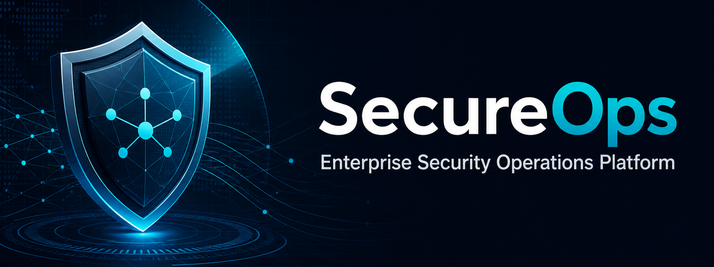
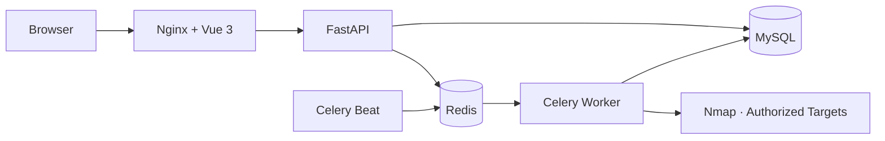
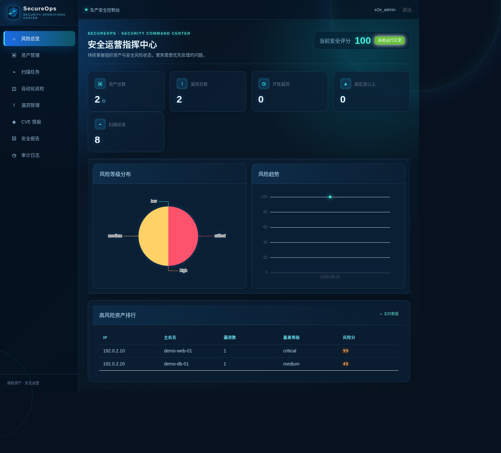
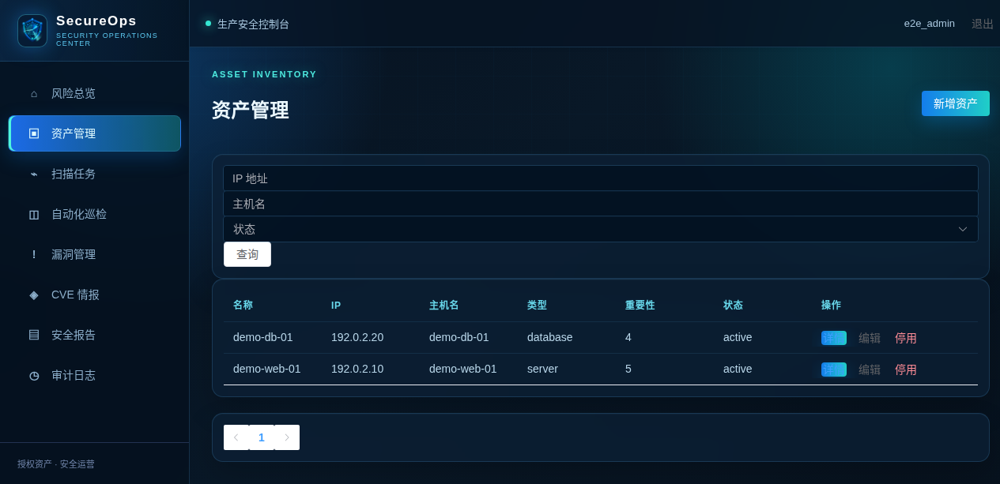
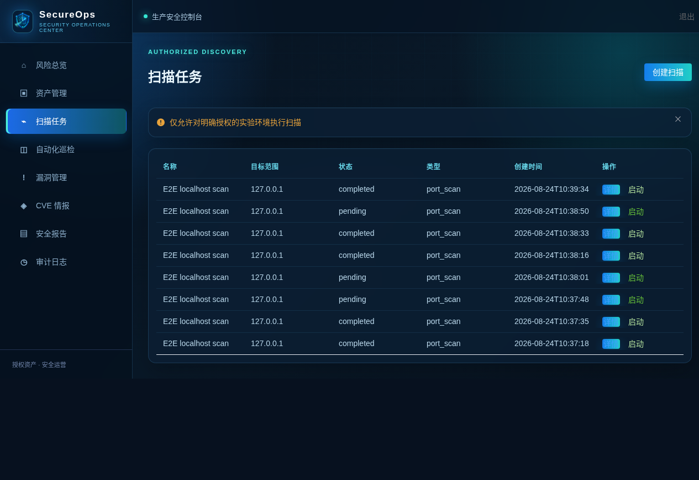
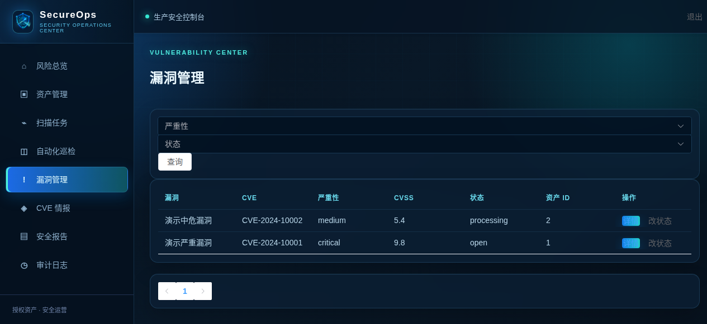
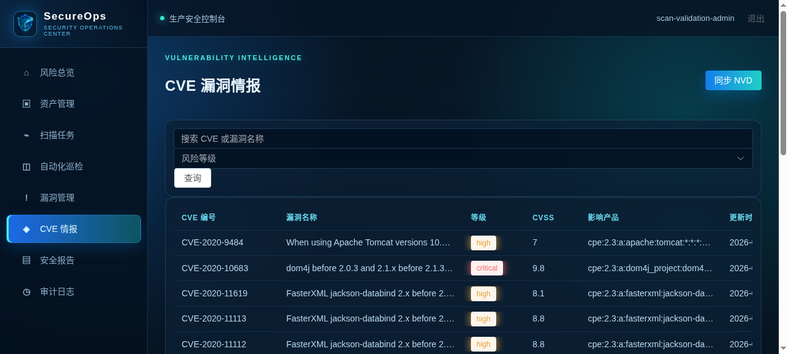
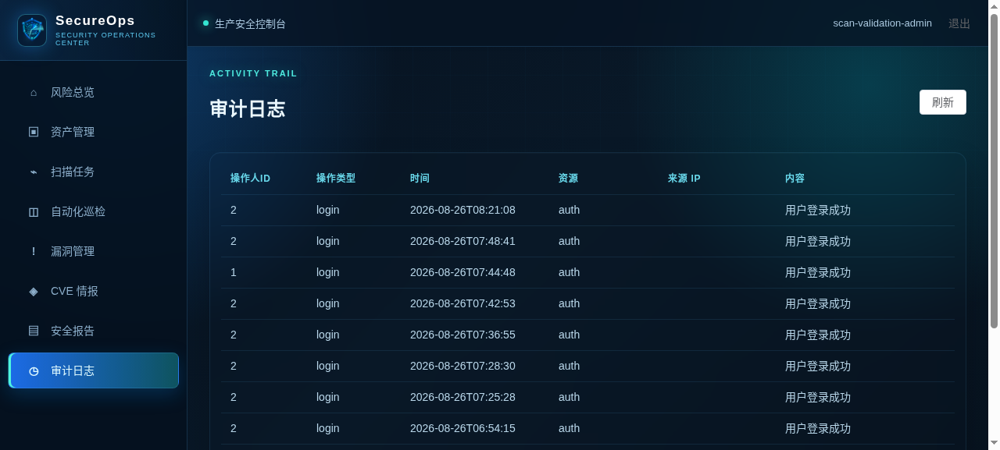
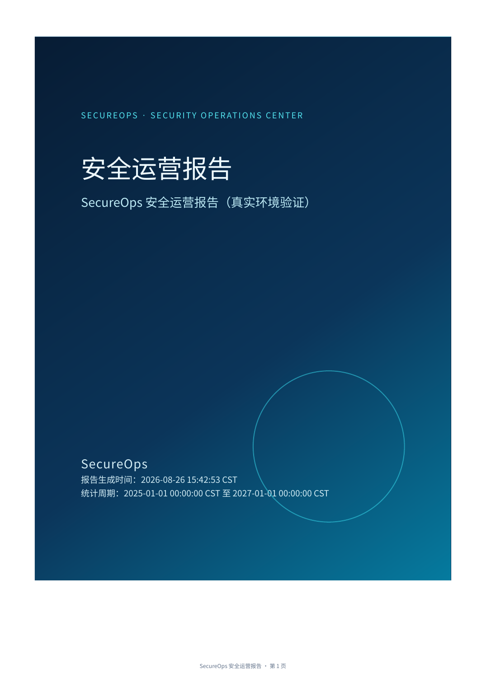

<div align="center">



# SecureOps

### 轻量级企业安全运营平台 · Lightweight Security Operations Platform

[](LICENSE)
[](docker/docker-compose.yml)

`Asset Management` · `Authorized Scanning` · `Vulnerability Management` · `Risk Analysis`

</div>

## 项目介绍

SecureOps 是一个面向**授权实验环境**的轻量级企业安全运营平台。它将资产登记、Nmap 服务识别、CVE 候选匹配、漏洞管理、风险分析、自动化巡检、审计记录与安全报告整合为可运行的 SOC MVP 闭环。

> 本项目用于授权测试、学习和演示；不包含漏洞利用、攻击验证或面向未授权目标的扫描能力。

## 核心能力

- JWT 认证、基础 RBAC 权限控制与操作审计
- 资产登记、状态管理、服务信息维护与停用策略
- 基于 Nmap 的授权扫描：端口、服务、产品与版本结构化保存
- 扫描结果 → 服务标准化 → CVE 候选匹配 → 漏洞记录 → 风险刷新的数据链路
- CVE/CVSS 情报管理与 NVD 增量同步
- 可解释风险评分、风险等级分布、高风险资产排行与趋势数据
- Redis + Celery Worker/Beat 自动化巡检
- 基于真实数据库快照的 HTML/PDF 安全运营报告
- Docker Compose 一键编排 MySQL、Redis、后端、前端与后台任务

## 系统架构



## 技术栈

| Layer | Stack |
| --- | --- |
| Frontend | Vue 3 · TypeScript · Element Plus · ECharts |
| Backend | FastAPI · SQLAlchemy · Alembic |
| Database | MySQL 8.4 |
| Async Jobs | Redis · Celery Worker · Celery Beat |
| Scanner | Nmap（仅授权实验环境） |
| Deployment | Docker Compose · Nginx |

## 真实验证链路

在授权实验目标上，SecureOps 已完成以下真实闭环验证：

```text
资产登记 → 创建扫描任务 → Nmap 服务/版本识别 → 结构化结果入库
→ CVE 候选匹配 → 漏洞记录与去重 → 风险刷新 → 安全报告生成
```

扫描对象与环境配置不会提交到仓库。若没有匹配到 CVE，系统仍会保留真实扫描结果并明确显示“暂无匹配 CVE”，不会伪造漏洞数据。

## Demo

- [观看或下载真实 Demo V2 录屏（WebM）](docs/demo-secureops-v2.webm)
- [查看公开 Demo 使用说明](docs/public/demo-flow.md)

Demo 使用隔离的 E2E 数据与授权测试目标，展示真实前端、API 与数据库交互。

## Screenshots

<table>
  <tr>
    <td width="50%" valign="top"><strong>安全总览</strong><br /></td>
    <td width="50%" valign="top"><strong>资产管理</strong><br /></td>
  </tr>
  <tr>
    <td width="50%" valign="top"><strong>扫描任务与结果</strong><br /></td>
    <td width="50%" valign="top"><strong>漏洞管理</strong><br /></td>
  </tr>
  <tr>
    <td width="50%" valign="top"><strong>CVE 情报</strong><br /></td>
    <td width="50%" valign="top"><strong>审计日志</strong><br /></td>
  </tr>
</table>

更多页面截图见 [截图目录](docs/public/screenshots/)。其中 PDF 报告封面来自当前版本使用真实数据库快照生成的报告；展示素材不包含扫描目标、账户密码或环境密钥。

## Security Report

报告由当前数据库快照生成，并以正式可读的 PDF 版式呈现：

- 安全概览：资产、漏洞、CVE 与高危及以上风险统计
- 中文风险等级分布与图表，不输出 JSON 或内部字段
- Top 高风险资产与 Top 高风险漏洞
- 扫描任务总量、完成/失败/运行中状态与成功率
- 基于真实统计自动生成的整改建议

报告中所有统计会随数据库数据变化而更新；空数据会以明确的业务提示展示，而不会伪造数据。

<p align="center">
  
</p>

## 快速部署

### 1. 克隆并创建本地配置

```bash
git clone https://github.com/Bitesdust-3/security-platform-public.git
cd security-platform-public
cp .env.example .env
```

编辑 `.env`，为 `MYSQL_PASSWORD`、`MYSQL_ROOT_PASSWORD` 与 `JWT_SECRET_KEY` 设置强随机值。`.env` 已被 Git 忽略，不应提交。

### 2. 启动服务

```bash
docker compose -f docker/docker-compose.yml --env-file .env up --build -d
docker compose -f docker/docker-compose.yml --env-file .env ps
```

首次启动时后端会等待 MySQL 健康检查并执行 Alembic 迁移。服务正常后访问：

- Web：`http://localhost:8080`
- API health：`http://localhost:8000/health`（如 Compose 暴露该端口）

生产模拟环境请使用 `.env.production.example` 创建**未提交**的 `.env.production`，设置 `ENVIRONMENT=production`、关闭演示数据，并限制 `CORS_ORIGINS`。

完整环境变量、部署步骤和故障排查见 [部署文档](docs/public/deployment.md)。

## 项目结构

```text
backend/      FastAPI、SQLAlchemy 模型、Alembic 迁移、Celery 任务
frontend/     Vue 3 管理后台
docker/       Dockerfile、Docker Compose、Nginx 配置
docs/public/  公开架构、安全、API、部署与使用文档
tests/        后端与迁移测试
```

## 文档

- [系统架构](docs/public/architecture.md)
- [部署说明](docs/public/deployment.md)
- [API 概览](docs/public/api.md)
- [安全设计](docs/public/security-design.md)
- [数据库设计](docs/public/database.md)
- [测试说明](docs/public/testing.md)
- [已知限制](docs/public/known-limitations.md)

## 安全边界

- 仅对拥有明确授权的资产或实验环境执行扫描。
- 扫描请求经过目标格式和授权范围校验；不会接受任意命令参数。
- 匹配到的 CVE 仅表示候选风险，需由安全人员复核后处置。
- 数据库密码、JWT 密钥、令牌、日志、数据库文件与个人开发资料均不纳入仓库。

## Roadmap

- [x] 资产、扫描、CVE、漏洞、风险、审计与报告核心闭环
- [x] Docker Compose、迁移和基础 CI 验证
- [ ] 提升 CPE/版本范围匹配准确率
- [ ] 增强多实例限流、监控与集中日志能力
- [ ] 完善更多授权实验环境的回归覆盖

## License

本项目基于 [MIT License](LICENSE) 发布。
