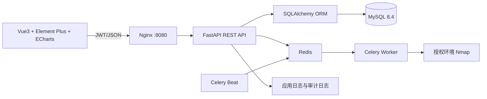
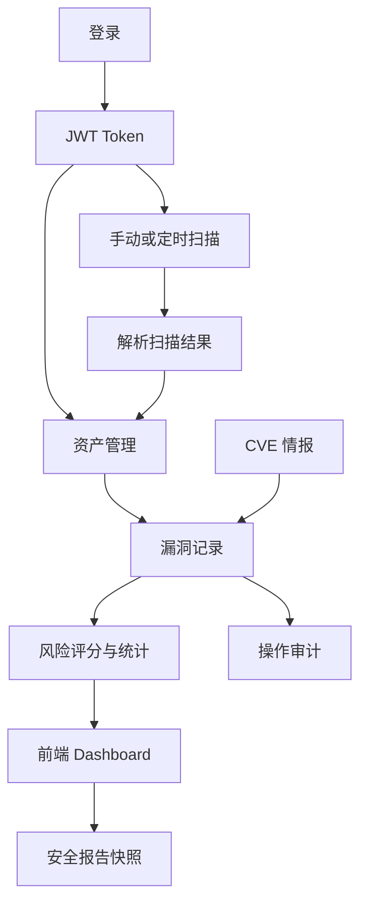

# 系统架构设计

系统按前后端分离组织：Nginx 提供前端静态文件并反向代理 `/api/`；FastAPI 提供认证、资产、扫描、漏洞、CVE、风险、报告和审计接口；SQLAlchemy/Alembic 负责持久化与迁移；Redis、Celery Worker 和 Beat 负责自动化巡检与 CVE 同步任务；Nmap 仅用于已授权目标的基础发现。

## 服务边界

- `backend`：API、ORM、认证、同步任务提交和报告生成。
- `frontend`：登录、资产、扫描、巡检、漏洞、CVE、风险、报告和审计页面。
- `mysql`：业务数据持久化。
- `redis`：Celery 消息代理和结果后端。
- `celery_worker`：执行定时巡检和外部 CVE 同步任务。
- `celery_beat`：按计划投递周期任务。
